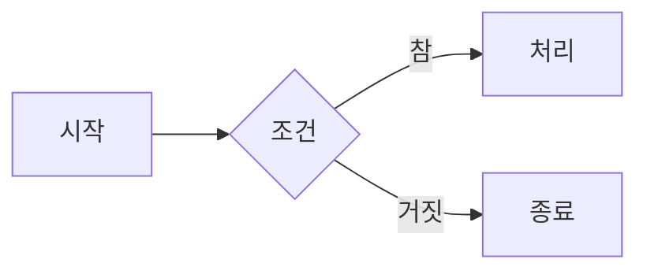

# 마크다운이란 무엇인가?
 ---
 ## 1. 마크다운의 개념
 ### 1.1 마크다운의 사전적 의미
 - 2004년에 존 그루버(John Gruber)가 만든 일반 텍스트에 몇가지 기호를 섞어 문서의 구조를 표현하는 표기방식.
 ### 1.2 설계 목적
 - 가능한 읽기 쉽게 만드는 것.
 - 태그나 서식 지시자로 표시된 것처럼 보이지 않은 채, 일반 텍스트 그대로 출판 가능하게 하는 것.
 ### 1.3 문법 형식
 - 마크다운 문서는 확장자가 `.md`인 텍스트 파일임.
 - 특별한 프로그램 없이 메모장으로도 열고 쓸 수 있음.

 ---

 ## 2. 제목
 ### 2.1 마크다운 문서에서 다루는 제목의 개념
 - 제목은 문서를 단계로 나누는 표시.
 - 제목을 표시하면 렌더러가 그것을 근거로 목차를 만들거나 각 절로 이동하는 링크를 자동으로 생성함.
 ### 2.2 문법 형식
 - 줄 맨 앞에 `#`을 놓고 공백을 하나 넣은 뒤 제목을 적어둠.
 - `#`의 개수가 단계를 뜻하며 1개부터 6개까지 사용 가능하며 `#`뒤에 공백은 생략할 수 없음.
 - 밑줄을 그어 제목을 만드는 방식도 있음. 글 아래 줄에 `=`를 이어 쓰면 1단계 `-`를 이어 쓰면 2단계가 됨. 이 방식은 2단계까지만 되고 `-`가 다른 문법과 헷갈리기 쉬워 잘 쓰이지 않음.

 ---
 
 ## 3. 문단과 줄바꿈
 ### 3.1 개념
 - GitHub 기분으로 줄을 그냥 바꾸면 줄이 바뀌지 않습니다. 처음 사용할 때 많이 헷갈리는 지점임.
 - 편집기에서 엔터를 눌러 줄을 나누고 저장했는데, 렌더링된 경과에서는 한줄로 이어져 있는 경우가 이것임.
 - 마크다운은 빈 줄을 문단의 경계로 삼고, 빈줄 없이 이어진 줄들은 한 문단의 내용으로 취급하기 때문.
 ### 3.2 문법 형식
 #### 문단 안에서 줄바꿈 방법
 - 줄 끝에 공백을 두개 넣는다.`··`
 - 줄 끝에 백슬래시를 넣는다.`\`
 - HTML 태그를 넣는다.`<br>`(HTML 태그를 허용하는 곳에서만 작동함.)

 ---

 ## 4. 강조
 ### 4.1 개념
 - 강조는 문장 안의 일부를 굵게 하거나 기울여 표시하는것.
 - 강조에는 두 단계가 있음. 기울임과 볼트체
 ### 4.2 문법 형식
 - 마크다운에서 강조는 별표(`*`)나 밑줄(`_`)로 감싸는 방식을 사용함.
 - 둘 다 같은 결과를 내지만 단어 중간에서는 동작이 다름
 #### 강조 규칙
 - 밑줄은 앞뒤가 글자로 둘러싸인 자리에서는 강조로 인식되지 않음.
 - 별표는 그런 제약이 없음.
 - 그래서 강조를 해야 할때는 보통 별표를 사용하는 것을 권장함.
 
 ---

 ## 5. 목록
 ### 5.1 개념
 - 목록은 여러 항목을 나열하는 표시. 순서가 의미를 갖는지에 따라 두 종류로 나뉨
 - 순서 있는 목록 : 힝목 사이에 순서가 의미를 가짐. 절차나 단계를 적을 때 사용함.
 - 순서 없는 목록 : 항목 사이에 순서가 없음. 준비물이나 특징을 나열할 때 사용함.

 ### 5.2 문법 형식
 #### 순서 있는 목록
 - 줄 앞에 숫자와 마침표를 놓고 공백을 넣음.
 #### 순서 없는 목록
 - 줄 앞에 `-`,`+`,`*`중 하나를 놓고 공백을 넣음. 세 기호 모두 같은 결과를 냄.
 #### 중첩
 - 목록 안에 목록을 넣으려면 들여쓰기를 함. 들여쓰기 칸 수는 정해진 숫자가 아니라 상위 항목의 내용이 시작되는 위치부터 시작함.
 #### 목록 안에 다른 내용 넣기
 - 목록 항목 아래에 문단이나 코드 블록을 넣으려면 규칙에 맞게 써야함.
 
 ---
 
 ## 6. 코드
 ### 6.1 개념
 문서 안에 코드를 넣을 때 일반 문장과 구분되게 표시해야함. 구분하지 않으면 두 가지 문제가 생김.
 - 코드 안의 기호가 마크다운 문법으로 해석됨
 - 읽는 사람이 어디까지가 코드인지 알기 힘듬.

 ### 6.2 문법 형식
 #### 인라인 코드
 - 백틱(```~```)으로 감쌈. 백틱 세개로 시작하고 세개로 닫을 수 있음
 - 이 표시를 펜스(fence)라고 부름.
 - 언어 지정 방법은 여는 펜스(fence)뒤에 언어 이름을 적으면됨.
 - 백틱의 개수는 코드 내용 속 백틱의 개수보다 많게 적어야함.
 
 ---
 
 ## 7. 인용문과 수평선
 ### 7.1 개념
 - 인용문은 다른 곳에서 가져온 문장이나 특별히 구분해 보일 내용을 표시함.
 - 렌더링하면 왼쪽에 세로선이 붙고 안쪽으로 들여쓰인 형태로 표시.
 ### 7.2 문법 형식
 #### 인용문
 - 줄 앞에 `>`를 붙임.
 - 여러 줄을 인용하려면 각 줄 앞에 `>`를 붙임.
 - `>`를 여러개 겹치면 인용 안의 인용이 됨.
 #### 수평선
 - `-`,`*`,`_`중 하나를 세개 이상이어서 한 줄에 사용함
 - 세 기호 모두 같은 결과를 내지만 `-`를 쓸 때는 윗줄에 글자가 있으면 수평선이 아니라 2단계 제목의 밑줄로 해석됨
 - 파일 맨 첫줄부터 `---`로 시작해 다시 `---`로 닫는 구간은 여러 도구에서 문서의 속성을 적는 영역으로 해석됨. 이 영역을 프런트매터(front matter)라고 부르며, 본문이 아니라 문서 정보로 취급됨.
 ## 8. 링크와 이미지
 ### 8.1 개념
 - 링크는 다른 문서나 웹 주소로 이동하는 표시 하는 것.
 - 이미지는 그림을 문서 안에 표시 하는 것.
 ### 8.2 문법 형식
 #### 인라인 링크
 - 대괄호`[]`에 표시할 글자를,소괄호`()`에 주소를 적어둠.
 #### 이미지
 - 링크 문법 앞에 느낌표를 붙임.
 ## 9. 표
 ### 9.1 개념
 - 표는 항목을 행과 열로 정리해 보이는 것.
 - 여러 대상을 같은 기준으로 비교할 때 문장보다 읽기 쉬움.
 ### 9.2 문법 형식
 - 파이프(`|`)로 칸을 나누고 첫줄이 열 이름, 둘째줄은 `-`로 구분행,셋째 줄부터 내용임.
 - 구분행에 콜론(`:`)을 넣어 글자 열의 정렬을 지정 가능함.
 - 내용에 백슬래시(`\`)를 앞에 붙여서 기호를 표시할 수 있음.
 ## 10. 확장 문법
 ### 10.0 개념
 - 표준 마크다운에 없지만 GitHub등에서 쓸 수 있는 문법들이 있음.
 - 이 문법들은 어디에서나 동작한다고 가정할 수 없음
 ### 문법 형식
 - 목록 항목 앞에 대괄호를 넣어 완료(체크)표시를 넣을 수 있음. `[]`
 - `~~`내용`~~` 물결표 두 개로 감싸서 취소선을 만들 수 있음.
 - `[^n]` 을 사용해 각주를 표시할 수 있음.
 #### 다이어그램
 - 코드 블록의 언어 자리에 `mermaid`를 적으면 그 안의 내용이 그림으로 그려짐.
 - 텍스트로 도표를 기술하는 표기법은 여러가지가 있으며 필요에 따라 적절히 사용하면 효과가 좋음
 



 
 ## 11. 렌더러에 따른 차이
 ### 11.1 개념
 - 같은 `.md` 파일이라도 어떤 프로그램으로 여느냐에 따라 결과가 달라질 수 있음.
 - 표준 문법은 어디서나 같게 보이지만, 확장 문법은 그 확장을 지원하는 곳에서만 동작함